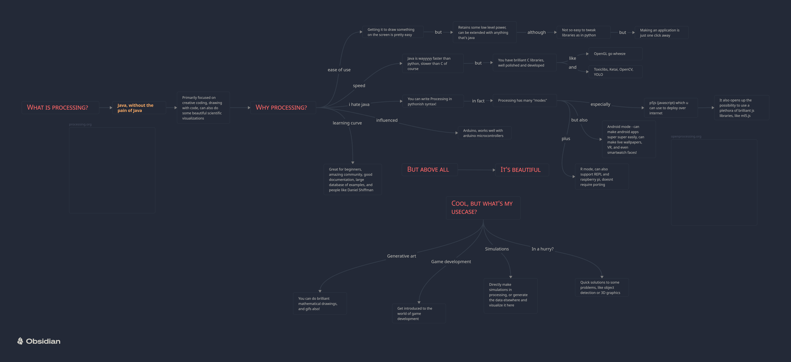
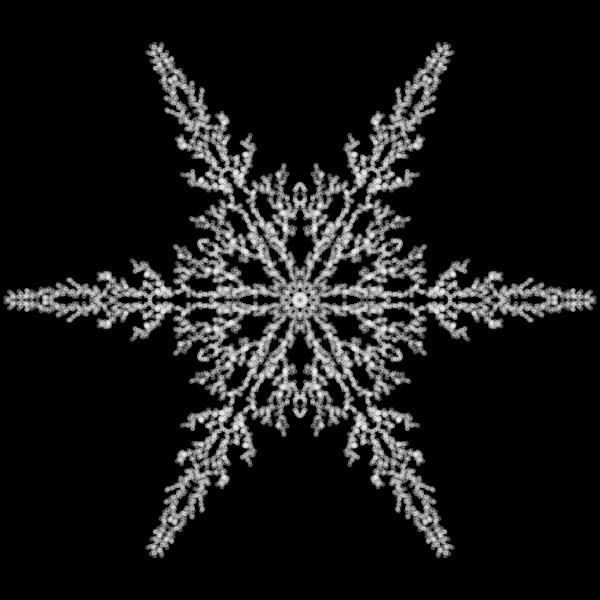

# Welcome to processing!

- For downloading, examples and documentation visit [the processing website](https://processing.org)
- Also check out websites of [p5.js](https://p5js.org/), [android](https://android.processing.org/) or the [python](https://py.processing.org/) mode of processing
- If you prefer to go through a book, [The Nature of Code](https://natureofcode.com/) by Daniel Shiffman is an excellent one 
- And of course, for YouTube videos, his channel [The Coding Train](https://www.youtube.com/@TheCodingTrain) can walk you through almost everything you can ask for 
- Or just open up the Examples (Ctrl + Shift + O) from the Processsing IDE

# Examples which were shown in the session

- The [OpenProcessing](https://openprocessing.org/) website (p5js!) 
- Some others to get you hyped up -
	- https://openprocessing.org/sketch/2124685
	- https://openprocessing.org/sketch/1921375
	- https://openprocessing.org/sketch/486307/
	- https://openprocessing.org/crayon/29
	- https://openprocessing.org/sketch/1240159
	- https://openprocessing.org/sketch/1255271
	- https://openprocessing.org/sketch/1593240
	- https://openprocessing.org/sketch/505097
	- https://openprocessing.org/sketch/1217113
	- https://openprocessing.org/sketch/2060705
	- https://www.patrik-huebner.com/creative-coding/ex8/
	- https://physicsub-198fbf007acd.herokuapp.com/simulations (Akshay Shankar is one of the contributors here!)
	- https://necessarydisorder.wordpress.com/2017/11/15/drawing-from-noise-and-then-making-animated-loopy-gifs-from-there/

# Why Processing?


---

# Cool! Let's Snowflake!

## The code we used - 
 - The complete original code can be found [***here***](snowflake/snowflake.pde). Some bonus sample gifs can also be found [here](snowflake/sample_output)
## References - 
- [Daniel Shiffman's Video](https://www.youtube.com/watch?v=XUA8UREROYE), on which our code was based on
- and [this](https://codegolf.stackexchange.com/questions/42506/draw-a-snowflake) Code Golf StackExchange thread
- [Diffusion Limited Aggregation](https://en.wikipedia.org/wiki/Diffusion-limited_aggregation)


# Workflow
## 1. Setting up

- Make a canvas, 600 pixels wide and 600 pixels tall, and draw a black background. Setup runs only once.

```
void setup()  {
  size(600, 600);
  background(0);
}
```

## 2. The void draw

- The code inside draw is kept running over and over again, each time the whole code inside draw is executed, the frame is updated. 

```
void setup()  {
  size(600, 600);
  background(0);
}

void draw()  {
}
```

## 3. Make the seed

- A nucleation point is drawn at the center of the canvas - an circle with radius of 50 pixels - `ellipse(width/2, height/2, rad, rad);`
- And its colored translucent white - `fill(255, 80);`
- And we don't want to draw the edge of the ellipse - `noStroke();`

```
float rad = 50;

void setup()  {
  size(600, 600);
  background(0);
  
  noStroke();
  fill(255, 80);
  ellipse(width/2, height/2, rad, rad);
  
}

void draw()  {
}
```

## 4. Introducing a new water molecule and making it move in a random walk

- Variables x and y will store the coordinates our molecule - `float x, y;`
- In reality it's often a small droplet of supercooled water, and not a individual molecule
- We initialize the position of our water droplet at the center of the canvas - `x = width/2; y = height/2;`
- Make it move randomly in (kinda) Brownian motion - `x = x + random(-dizziness, dizziness); y = y + random(-dizziness, dizziness);`
- Draw the point - `point(x, y);`
- And color it aqua - `stroke(0, 150, 150);`

```
float x, y;
float rad = 50;
float dizziness = 5;

void setup()  {
  size(600, 600);
  background(0);
  
  noStroke();
  fill(255, 80);
  ellipse(width/2, height/2, rad, rad);
  
  x = width/2;
  y = height/2;  
  
}

void draw()  {
  
  x = x + random(-dizziness, dizziness);
  y = y + random(-dizziness, dizziness);
  stroke(0, 150, 150);
  point(x, y);
    
}
```

## 5. Let's spawn our molecule in one side and push it gently towards the nucleation point

- Start from the edge - `x = 0; y = height/2;`
- Push it forward - `x = x + random(-dizziness/4, dizziness);`

```
float x, y;
float rad = 50;
float dizziness = 5;

void setup()  {
  size(600, 600);
  background(0);
  
  noStroke();
  fill(255, 80);
  ellipse(width/2, height/2, rad, rad);
  
  x = 0;
  y = height/2;  
  
}

void draw()  {
  
  x = x + random(-dizziness/4, dizziness);
  y = y + random(-dizziness, dizziness);
  stroke(0, 150, 150);
  point(x, y);
    
}
```

## 6. If it fails to stick, reset to initial position, and try again

- if it escapes beyond half of the canvas -  `if (x > width/2)`

```
float x, y;
float rad = 50;
float dizziness = 5;

void setup()  {
  size(600, 600);
  background(0);
  
  noStroke();
  fill(255, 80);
  ellipse(width/2, height/2, rad, rad);
  
  x = 0;
  y = height/2;  
  
}

void draw()  {
  
  x = x + random(-dizziness/4, dizziness);
  y = y + random(-dizziness, dizziness);
  stroke(0, 150, 150);
  point(x, y);
  
  if (x > width/2)  {
      x = 0;
      y = height / 2;
    }
    
}
```

## 7. Stick and freeze

- If the water molecule meets ice (i.e. white at (x, y)) - `if ( red(get(round(x), round(y))) != 0 )`
- Then freeze - `ellipse(x, y, rad, rad);`

```
float x, y;
float rad = 50;
float dizziness = 5;

void setup()  {
  size(600, 600);
  background(0);
  
  noStroke();
  fill(255, 80);
  ellipse(width/2, height/2, rad, rad);
  
  x = 0;
  y = height/2;  
  
}

void draw()  {
  
  x = x + random(-dizziness/4, dizziness);
  y = y + random(-dizziness, dizziness);
  stroke(0, 150, 150);
  point(x, y);
  
  if (x > width/2)  {
      x = 0;
      y = height / 2;
    }
    
  if ( red(get(round(x), round(y))) != 0 )  {
    noStroke();
    ellipse(x, y, rad, rad);
    x = 0;
    y = height / 2;
  }
    
}
```

## 8. Bringing out the 6 × 2 - fold symmetry 

- Shift origin to the center of the canvas - `translate(width/2, height/2);`
- Coordinates in the new frame is now - `x = x - width/2; y = y - height/2;`
- Now rotate and draw 6 times - `ellipse(x, y, rad, rad); rotate(PI/3);`
- Reflect about x axis - `y = -y;`
- And draw 6 more

```
float x, y;
float rad = 50;
float dizziness = 5;

void setup()  {
  size(600, 600);
  background(0);
  
  noStroke();
  fill(255, 80);
  ellipse(width/2, height/2, rad, rad);
  
  x = 0;
  y = height/2;  
  
}

void draw()  {
  
  x = x + random(-dizziness/4, dizziness);
  y = y + random(-dizziness, dizziness);
  stroke(0, 150, 150);
  point(x, y);
  
  if (x > width/2)  {
      x = 0;
      y = height / 2;
    }
    
  if ( red(get(round(x), round(y))) != 0 )  {
    noStroke();
    
    translate(width/2, height/2);
    x = x - width/2;
    y = y - height/2;
      
    ellipse(x, y, rad, rad);
    rotate(PI/3);    
    ellipse(x, y, rad, rad);
    rotate(PI/3);    
    ellipse(x, y, rad, rad);
    rotate(PI/3);    
    ellipse(x, y, rad, rad);
    rotate(PI/3);    
    ellipse(x, y, rad, rad);
    rotate(PI/3);    
    ellipse(x, y, rad, rad);
    rotate(PI/3);    
    
    y = -y;
    
    ellipse(x, y, rad, rad);
    rotate(PI/3);    
    ellipse(x, y, rad, rad);
    rotate(PI/3);    
    ellipse(x, y, rad, rad);
    rotate(PI/3);    
    ellipse(x, y, rad, rad);
    rotate(PI/3);    
    ellipse(x, y, rad, rad);
    rotate(PI/3);    
    ellipse(x, y, rad, rad);
    rotate(PI/3);    
    
    x = 0;
    y = height / 2;
  }
    
}
```

## 9. It's messy, lets clean this up

- `for` loops ftw yay - `for(int i=0; i<6; i++)`

```
float x, y;
float rad = 50;
float dizziness = 5;

void setup()  {
  size(600, 600);
  background(0);
  
  noStroke();
  fill(255, 80);
  ellipse(width/2, height/2, rad, rad);
  
  x = 0;
  y = height/2;  
  
}

void draw()  {
  
  x = x + random(-dizziness/4, dizziness);
  y = y + random(-dizziness, dizziness);
  stroke(0, 150, 150);
  point(x, y);
  
  if (x > width/2)  {
      x = 0;
      y = height / 2;
    }
    
  if ( red(get(round(x), round(y))) != 0 )  {
    noStroke();
    
    translate(width/2, height/2);
    x = x - width/2;
    y = y - height/2;
      
    for(int i=0; i<6; i++)  {
      ellipse(x, y, rad, rad);
      rotate(PI/3);
    }
  
    y = -y;
    
    for(int i=0; i<6; i++)  {
      ellipse(x, y, rad, rad);
      rotate(PI/3);
    }    
    
    x = 0;
    y = height / 2;
  }
    
}
```

## 10. Let's clean up even more!

- Packing up everything into the - `void draw_snowflake()`

```
float x, y;
float rad = 50;
float dizziness = 5;


void setup()  {
  size(600, 600);
  background(0);
  
  noStroke();
  fill(255, 80);
  ellipse(width/2, height/2, rad, rad);
  
  x = 0;
  y = height/2;  
  
}


void draw()  {
  
  x = x + random(-dizziness/4, dizziness);
  y = y + random(-dizziness, dizziness);
  stroke(0, 150, 150);
  point(x, y);
  
  if (x > width/2)  {
      x = 0;
      y = height / 2;
    }
    
  if ( red(get(round(x), round(y))) != 0 )  {
    noStroke();
    
    draw_snowflake();
    
    x = 0;
    y = height / 2;
  }
    
}


void draw_snowflake()  {
  
  translate(width/2, height/2);
  x = x - width/2;
  y = y - height/2;
  
  for(int i=0; i<6; i++)  {
    ellipse(x, y, rad, rad);
    rotate(PI/3);
  }

  y = -y;
  
  for(int i=0; i<6; i++)  {
    ellipse(x, y, rad, rad);
    rotate(PI/3);
  }
  
}
  
```


## 11. Let's make it faster, much faster 

- Removing the speed limit of the maximum frame rate by not drawing a new frame until one molecule happens to stick - `while ( red(get(round(x), round(y))) == 0 )`
- No more new drawing when snowflake edge hits canvas edge - `if (x < rad) noLoop();`

```
float x, y;
float rad = 50;
float dizziness = 5;


void setup()  {
  
  size(600, 600);
  background(0);
  
  noStroke();
  fill(255, 80);
  ellipse(width/2, height/2, rad, rad);
  
  
}


void draw()  {
  
  x = 0;
  y = height/2;  
  
  while ( red(get(round(x), round(y))) == 0 )  {
    x = x + random(-dizziness/4, dizziness);
    y = y + random(-dizziness, dizziness);
    
    stroke(0, 150, 150);
    point(x, y);
    
    if (x > width/2)  {
      x = 0;
      y = height / 2;
    }
  }
  
  if (x < rad) noLoop();

  noStroke();
  draw_snowflake();

}


void draw_snowflake()  {
  
  translate(width/2, height/2);
  x = x - width/2;
  y = y - height/2;
  
  for(int i=0; i<6; i++)  {
    ellipse(x, y, rad, rad);
    rotate(PI/3);
  }

  y = -y;
  
  for(int i=0; i<6; i++)  {
    ellipse(x, y, rad, rad);
    rotate(PI/3);
  }
  
}
```

## 12. Tweak the parameters 

- It still looks more like a snow blob rather than a snowflake.
- So let's make 'sticking radius' close to the 'mean free path' - `float rad = 5;`

```
float x, y;
float rad = 5;
float dizziness = 5;


void setup()  {
  
  size(600, 600);
  background(0);
  
  noStroke();
  fill(255, 80);
  ellipse(width/2, height/2, rad, rad);
  
  
}


void draw()  {
  
  x = 0;
  y = height/2;  
  
  while ( red(get(round(x), round(y))) == 0 )  {
    x = x + random(-dizziness/4, dizziness);
    y = y + random(-dizziness, dizziness);
    
    stroke(0, 150, 150);
    point(x, y);
    
    if (x > width/2)  {
      x = 0;
      y = height / 2;
    }
  }
  
  if (x < rad) noLoop();

  noStroke();
  draw_snowflake();

}


void draw_snowflake()  {
  
  translate(width/2, height/2);
  x = x - width/2;
  y = y - height/2;
  
  for(int i=0; i<6; i++)  {
    ellipse(x, y, rad, rad);
    rotate(PI/3);
  }

  y = -y;
  
  for(int i=0; i<6; i++)  {
    ellipse(x, y, rad, rad);
    rotate(PI/3);
  }
  
}
```

## 13. Remove trails and save the snowflake

- We don't need the random walk trails anymore so we remove the line which was drawing the points
- And we save the image when our snowflake is finished - `saveFrame();`

```
float x, y;
float rad = 5;
float dizziness = 5;


void setup()  {
  
  size(600, 600);
  background(0);
  
  noStroke();
  fill(255, 80);
  ellipse(width/2, height/2, rad, rad);
  
}


void draw()  {
  
  x = 0;
  y = height/2;  
  
  while ( red(get(round(x), round(y))) == 0 )  {
    x = x + random(-dizziness/4, dizziness);
    y = y + random(-dizziness, dizziness);
    
    if (x > width/2)  {
      x = 0;
      y = height / 2;
    }
  }
  
  if (x < rad)  {
    noLoop();
    saveFrame();
  }

  noStroke();
  draw_snowflake();

}


void draw_snowflake()  {
  
  translate(width/2, height/2);
  x = x - width/2;
  y = y - height/2;
  
  for(int i=0; i<6; i++)  {
    ellipse(x, y, rad, rad);
    rotate(PI/3);
  }

  y = -y;
  
  for(int i=0; i<6; i++)  {
    ellipse(x, y, rad, rad);
    rotate(PI/3);
  }
  
}
```

## And you get your perfect snowflake!



- Don't forget to play around and tweak your parameters! Feel free to drop me a mail if you have any questions or suggestions!

- Happy snowflaking :D ❄